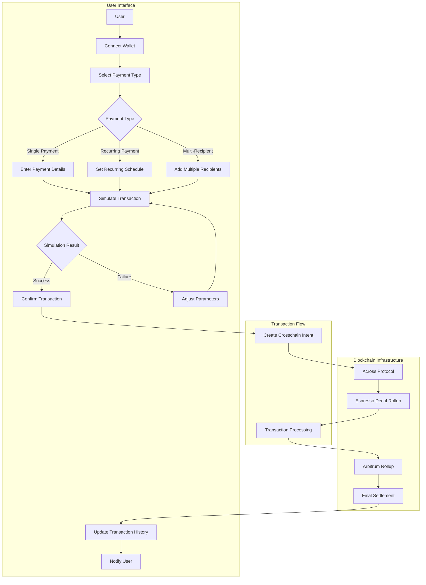

# Fluid Pay - Cross-Chain Payment Application

FluidPay is a seamless cross-chain payments hub built on the Arbitrum-Decaf rollup, leveraging ERC-7683 for decentralized, intent-based transfers. It provides a streamlined user experience for conducting payments across multiple chains with rapid transaction finality using Espresso confirmations.

## Features

- **Cross-Chain Payments**: Send payments between different blockchain networks
- **Crosschain Intents**: Support for different phases of crosschain intent execution
- **Wallet Integration**: Connect with popular Web3 wallets using RainbowKit
- **Transaction History**: Track all your cross-chain transactions
- **Modern UI**: Clean, responsive interface with light theme
- **Real-time Updates**: Instant feedback on transaction status
- **Multi-Chain Support**: Currently supports Ethereum and Polygon networks
- **Espresso Integration**: Leverages Espresso Decaf test for enhanced transaction processing
- **Arbitrum Rollup**: Utilizes Arbitrum Sepolia rollup for secure and efficient transaction execution
- **Transaction Simulation**: Simulate transactions before execution
- **Recurring Payments**: Set up automated recurring cross-chain payments
- **Multi-Recipient Support**: Send payments to multiple recipients in a single transaction

## 🔄 Crosschain Intents

Crosschain Intents represent a paradigm shift in blockchain transactions, where users specify desired outcomes rather than execution paths. Fluid Pay supports multiple phases of crosschain intent evolution:

### Phase 1: Simple Asset Transfer

- Users specify moving the same asset from Chain A to Chain B
- Basic cross-chain transfer functionality
- Supported since 2021

### Phase 2: Asset Transfer with Destination Execution

- Users specify moving the same asset from Chain A to Chain B
- Includes embedded instructions for execution on the destination chain
- Enables complex post-transfer operations

### Phase 3: Cross-Chain Swaps with Execution

- Users specify swapping asset X on Chain A for a minimum amount of asset Y on Chain B
- Includes embedded instructions for execution on the destination chain
- Supports complex cross-chain trading scenarios

## 🏗️ Project Architecture

```
frontend/
├── app/
│   ├── components/
│   │   ├── simulation/
│   │   │   ├── TransactionSimulator.tsx    # Transaction simulation interface
│   │   │   └── types.ts                    # Type definitions for simulation
│   │   ├── payment/
│   │   │   ├── PaymentForm.tsx             # Payment form component
│   │   │   └── PaymentHistory.tsx          # Transaction history display
│   │   └── common/
│   │       ├── Button.tsx                  # Reusable button component
│   │       └── Input.tsx                   # Reusable input component
│   ├── hooks/
│   │   ├── useCrossChainPayment.ts         # Custom hook for payment logic
│   │   ├── useTenderlySimulation.ts        # Transaction simulation hook
│   │   └── useTransactionHistory.ts        # Transaction history management
│   ├── globals.css                         # Global styles and Tailwind config
│   ├── layout.tsx                          # Root layout component
│   ├── page.tsx                            # Main application page
│   └── providers.tsx                       # Web3 providers setup
├── public/                                # Static assets
└── package.json                           # Project dependencies
```

### Key Components

1. **Web3 Integration**

   - Uses Wagmi for Ethereum interactions
   - RainbowKit for wallet connection
   - Custom hooks for payment logic
   - Espresso Decaf test integration
   - Arbitrum Sepolia rollup support
   - Tenderly API for transaction simulation

2. **UI Components**

   - Responsive design with Tailwind CSS
   - Modern light theme with subtle animations
   - Form validation and error handling
   - Transaction history display
   - Simulation interface
   - Payment form with multi-recipient support

3. **State Management**
   - React hooks for local state
   - Web3 state management through Wagmi
   - Transaction history tracking
   - Simulation state management

## 🛠️ Tech Stack

- **Frontend Framework**: Next.js 14 with App Router
- **Language**: TypeScript
- **Styling**: Tailwind CSS
- **Web3 Integration**:
  - Wagmi
  - RainbowKit
  - Ethers.js
  - WalletConnect (for multi-wallet support)
- **Blockchain Infrastructure**:
  - Espresso Decaf Rollup (for transaction processing and finality)
  - Arbitrum Sepolia rollup (for secure execution)
  - Across Protocol (for crosschain intents management)
  - Alchemy (for blockchain data and infrastructure)
  - Tenderly API (for transaction simulation)
- **Development Tools**:
  - ESLint
  - Prettier
  - TypeScript
  - Jest (for testing)
- **APIs & Services**:
  - Espresso API (for transaction processing)
  - Across Protocol API (for intent-based transfers)
  - Alchemy API (for blockchain data access)
  - Tenderly API (for transaction simulation)
  - WalletConnect API (for wallet connections)

## 🚀 Getting Started

### Prerequisites

- Node.js (v18 or higher)
- npm or yarn
- Web3 wallet (MetaMask, Rainbow, etc.)
- Access to Espresso Decaf test environment
- Arbitrum Sepolia rollup configuration
- Tenderly API key

### Installation

1. Clone the repository:

   ```bash
   git clone [repository-url]
   cd fluid-pay
   ```

2. Install dependencies:

   ```bash
   cd frontend
   npm install
   ```

3. Configure environment variables:
   Create a `.env.local` file in the frontend directory with:

   ```
   NEXT_PUBLIC_WALLETCONNECT_PROJECT_ID=your_project_id
   NEXT_PUBLIC_ARBITRUM_ROLLUP_ID=your_rollup_id
   NEXT_PUBLIC_ESPRESSO_API_KEY=your_espresso_api_key
   NEXT_PUBLIC_TENDERLY_ACCOUNT=your_tenderly_account
   NEXT_PUBLIC_TENDERLY_PROJECT=your_tenderly_project
   NEXT_PUBLIC_TENDERLY_ACCESS_KEY=your_tenderly_access_key
   ```

4. Start the development server:

   ```bash
   npm run dev
   ```

5. Open [http://localhost:3000](http://localhost:3000) in your browser

## 📝 License

This project is licensed under the MIT License - see the [LICENSE](LICENSE) file for details.

## 📊 System Flow



### Flow Explanation

1. **User Interaction Flow**

   - User connects wallet using WalletConnect
   - Selects payment type (single, recurring, or multi-recipient)
   - Enters payment details based on selected type

2. **Transaction Simulation**

   - System simulates transaction using Tenderly API
   - Validates transaction parameters
   - Provides feedback on potential issues

3. **Crosschain Intent Creation**

   - Creates intent-based transaction using Across Protocol
   - Specifies desired outcome rather than execution path
   - Embeds necessary instructions for destination chain

4. **Transaction Processing**

   - Espresso Decaf Rollup processes transaction
   - Provides rapid transaction finality
   - Ensures secure execution through Arbitrum rollup

5. **Settlement & Updates**

   - Final settlement occurs on destination chain
   - Transaction history is updated
   - User receives notification of completion

6. **Error Handling**
   - Failed simulations return to parameter adjustment
   - Transaction failures trigger appropriate error messages
   - System maintains state for retry attempts

## 🙏 Acknowledgments

- [Wagmi](https://wagmi.sh/) for Web3 integration
- [RainbowKit](https://www.rainbowkit.com/) for wallet connection
- [Next.js](https://nextjs.org/) for the framework
- [Tailwind CSS](https://tailwindcss.com/) for styling
- [Espresso](https://www.espressosys.com/) for transaction processing
- [Arbitrum](https://arbitrum.io/) for rollup infrastructure
